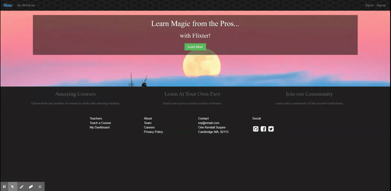

# Flixter

A two-sided video streaming marketplace platform where users can teach or enroll in courses. Built using Ruby, Rails, HTML, CSS, and JavaScript. Featuring credit card payment capabilities and user role management.

[View the deployed application](https://flixter-alyssa-redman.herokuapp.com/)

____________

### Features

* Ruby 2.5.3

* JavaScript

* jQuery drag-and-drop functionality for organizing content

* PostgresSQL database

* Devise for user authentication

* Simple Form gem for form submission

* Amazon Web Service (AWS) for image storage

* Figaro gem for secure configuration

* CarrierWave for file uploads

* MiniMagic gem for image resizing

* Stripe integrated to process payments for enrolment fees

_____________

###Installation

From this repository click <b>Clone or download</b> and copy command for SSH `git@github.com:alyred3/flixter.git` or HTTPS `https://github.com/alyred3/flixter.git`

From terminal window change to local directory where you want to clone repo

Paste clone command into command line `$ git clone git@github.com:alyred3/flixter.git` or `$ git clone https://github.com/alyred3/flixter.git`

Run `$ bundle install`

Run `$ bundle exec figaro install` to add `config/application.yml`  to add to your `.gitignore`

Add AWS keys to `config/application.yml` to congifure application to connect to you Amazon S3 account for image uploading
[Amazon S3 accounts can be set up here](https://docs.aws.amazon.com/AmazonS3/latest/gsg/SigningUpforS3.html)

______________

### Installation
From this repository click <b>Clone or download</b> and copy command for SSH `git@github.com:alyred3/flixter.git` or HTTPS `https://github.com/alyred3/flixter.git`

From terminal window change to local directory where you want to clone repo

Paste clone command into command line `$ git clone git@github.com:alyred3/flixter.git` or `$ git clone https://github.com/alyred3/flixter.git`

Run `$ bundle install`

____________

### How to use

#### Create an account

#### View premium content by paying any enrollment fees

#### Add new courses by clicking "Teach a course"

#### Manage courses you're teaching and enrolled in by accessing "My Dashboard". Teachers can enter Admin mode to add new sections and lessons, reorganize content using drag and drop, and preview as a student  

